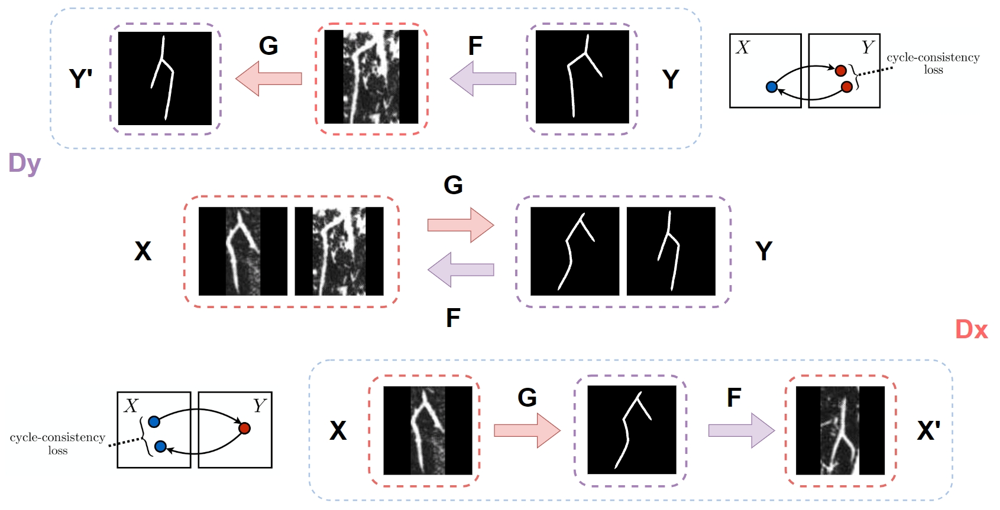

# Decoding the Past: Innovative AI Models for Oracle Bone Character Identification

## Project Background


**Oracle Bone Characters (OBC)**, one of the earliest forms of writing in China, are crucial for understanding ancient religious practices and daily lives. Inscribed on animal bones and shells, these artifacts, known as **Oracle Bone Scripts (OBS)** *(The abbreviations used for Oracle Bone Characters are OBC*, denoting individual characters, and OBS, representing the animal bones or shells inscribed with OBC.), offer pivotal historical and cultural insights. Yet, the identification of OBC poses substantial challenges due to factors such as  **Cracks**, **Weathering**, **Similarities** and the **Sheer Volume of Characters**, mainly caused by the long-timed burying. Our goal is to help archaeologists improve the efficiency of Oracle exploration.

In actual archaeological excavations, researchers initially need to carefully separate each character on the bones or shells. Subsequently, they identify whether the characters are deciphered or undeciphered, and match to modern Chinese characters. Nowadays, with the advancements in Artificial Intelligence (AI) and Artificial General Intelligence (AGI), there is a growing interest in using AI to develop models that help archaeologists identify OBC that are already deciphered. However, existing models often struggle with accuracy and fail to discern OBC on OBS due to the excavation process, rendering them less practical. To address these issues, we have developed our own pipeline comprising three key components: 

1. **OBS Detection**: We develop a **YOLO-X based OBS detection model (YOLO-X-OBS) which could help archaeologists extract each OBC from bones or shells**. The model is trained on Oracle Bone Inscription Detection Dataset downloaded from YinQiWenYuan (殷契文渊). For YOLO-X-OBS, **we achieve 47.3\% AP at a speed of 53.4 FPS** on RTX3090Ti, which is probably the most accurate OBS detection model in the industry.
2. **Scanned to Hand Printed Transcript**: To convert Scanned OBC into clearer, hand-printed versions, we employ two methods to meet the requirements of different usages. The first involves traditional image processing techniques like: **Gray-scale Conversion**, **edge sharpening Filter**, **Binary Processing**, and **Denoising**. The second method uses the idea from GAN to enhance the model capability which called **OBC-Trans-GAN** through accurate transformation and generalization. OBC in hand-printed format is easier to identify.
3. **OBC Recognition**: Recognizing OBC is a critical aspect of our pipeline. By leveraging **OBC Vision-Transformer (OBC-VIT)**, and training on the HUST-OBS Dataset, we achieve an impressive accuracy of **97.2\%**. Additionally, to **handle long-tailed problem**, we design a Hieroglyphics only augmenting method for rarely represented characters to improve recognition performance.


## Methods and Innovative Process Flow

As shown in previous figure, we propose an innovative AI based pipeline to solving archaeological problem. Firstly, the detection part excels in segmenting and identifying individual OBC from OBS, generating a multitude of images for analysis. Archaeologists, upon unearthing OBS, face the initial task of isolating each Oracle Bones Character, akin to character recognition in deep learning's Optical Character Recognition (OCR) and target detection algorithms. We have employed the **YOLO-X** based detection model and train from the YinQiWenYuan (殷契文渊) website to achieve this goal. Moreover, we implement a transcription part to convert the **Scanned OBC** into a **Hand Printed** version, while enhancing image clarity in the same time. To carry out the purpose, we combine two methods. The first method follows a conventional computer recognition approach, involving the conversion of images to **Gray-Scale**, application of **Edge-Sharpening Filters**, **Binary Processing** to isolate white areas in the scanned version, and subsequent denoising and inversion of images. In the second method, we develop **OBC-Trans-GAN** to restore the image through precise transformation and generalization. 


## YOLO-X based OBS Detection Model
For most of existing models that identify OBC, they are not such practical that researchers can’t use them to identify OBC on OBS once they dig out some OBS. With this aim, we build the detection part. Detection part can help us segment the OBS and produce some images that each image only includes one OBC, as shown in below figure. In our detection part, we firstly locate the bounding box of each OBC, and cut the character to produce a scanned version of this character. The format of the bounding box is [X1, Y1, X2, Y2], which means the coordinates of the top left and bottom right. Our detection part use YOLO-X framework.

### The steps to run YOLO-X-OBS
```bash
cd PROJECT_DIR
git clone 
https://github.com/zhz5687/Transformer-OBS-Recognition
conda create -n obs-det python=3.9
conda activate obs-det
pip install -r requirements.txt
pip install -e git+https://github.com/samson-wang/cython_bbox.git#egg=cython-bbox
python obs_detection/detect.py
```


## Scanned to Hand Printed Transcription
From the detection part, we can get a scanned version OBC. Then, we build the transcript part to the Hand-printed version. In the meantime, make the images more distinct. We have two thoughts to achieve the aims, and here are details of them. Firstly, traditional computer vision methods are used to handle simple transcript problems, and Generative Adversarial networks (GAN) methods are used to restore severely missing or indistinguishable ones. For some challenging transcript scenarios, traditional image processing methods may not work well. Here, we draw on the ideas of **CycleGAN** and propose an innovative model **OBC-Trans-GAN**, which is a framework designed for image-to-image translation tasks. CycleGAN is the abbreviation of Cycle-Consistent Generative Adversarial Network. It can help us to transfer the style of one picture to another style. For example, if people give some pictures of zebras and horses, the model can identify the style of the two different animals. Then, once we input a picture of zebra, it can give us a picture of the horse, or the other way around, without changing setting and other objects in the picture, just like the example below. In our scenario, given a blurred and incomplete **Scanned** image, convert it into **Hand Printed** image, as shown in below image. 

### The steps to run OBC-Trans-GAN
```bash
cd PROJECT_DIR
git clone 
https://github.com/zhz5687/Transformer-OBS-Recognition
conda activate obs-det
python GAN/obs_train.py --gpu 0 --gen_img_dir xxx--num_steps 100000 --batch_size 32
```




## OBC Vision-Transformer (OBC-VIT)
We referenced two projects: one [(Deep-Learning-for-Oracle-Bone-Script-Recognition)](https://github.com/cuicaihao/Deep-Learning-for-Oracle-Bone-Script-Recognition/tree/master) used Qt to create the GUI but the model is not very accuracte, while the other one [(HUST-OBC)](https://github.com/Pengjie-W/HUST-OBC/tree/main?tab=readme-ov-file#validation) created a large OBC dataset. We promoted the interface of the first one, and optimized and amended the second one to use the Validation part. As a result, we got an intelligent and  accurate model. Once we write an OBC (Oracle Bones Character), it shows us what's the Chinese the OBC represents.


### Step 1: Download the project

Download the project using git clone command.

```bash
cd PROJECT_DIR
git clone 
https://github.com/zhz5687/Transformer-OBS-Recognition
conda create --name obc python=3.8.19
pip install torch==2.0.1 torchvision==0.15.2 torchaudio==2.0.2
pip install torch
pip install PySide6
pip install tensorboard
pip install click -i https://pypi.tuna.tsinghua.edu.cn/simple
```
There's another part of the program that't too big to put here, you can download [here](https://pan.baidu.com/s/1XlUjOg7S51yKuPkrKkOpKw?pwd=1234).

### Step 2: Create Environment 

We prepared the environment required for you. You can downoad it [here]( https://pan.baidu.com/s/1N2FAqHrLoz_Ol8q7ZtkGkQ?pwd=1234)
and import it to Anaconda.
When you run the program, you need to run it in this environment.
```bash
conda activate Transformer
```

### Step 3: Download the Dataset

We use the [HUST](https://arxiv.org/html/2401.15365v1) dataset, which can be download [here](https://figshare.com/articles/dataset/HUST-OBS/25040543). After downloading it, move to the project file you download from github.


### Step 4: Train or Test your OBS model
You can use [train.py](train.py) for fine-tuning or retraining. Once the model is downloaded, you can use [test.py](test.py) to validate the test set with an accuracy of 94.3%. [log.csv](log.csv) records the changes in training set accuracy and test set accuracy for each epoch. 
[Validation_label.json](Validation_label.json) stores the relationship between classification IDs and dataset category IDs. 

If you don't want to train your own model, you can directly use our checkpoints (checkpoint_ep0600.pth). We have resnet version and VIT version.

### Step 5: Try to run the program

Now you can try to run the program using command.
```bash
python gui.py
```

## 4 Introduction of the interface


Once you load this interface, you can just write the OBC that you want to identify on the "输入" part, and click the "运行" button. Then the interface will show like that:


The prediction ID means the ID in the model. If the accuracy shows 1.000, it means the program is very sure about the outcome. On the contrast, while it is 0.0000, it means it can't make sure at all. There are also several other possibilities beneath it, and the numbers after these characters are not their ID, but their number in the dataset. And you want to identify another OBC, you can click the "清空" botton, and write another OBC.


## License

The MIT License (MIT), Copyright (c) 2024, Hanzhi Zhang
